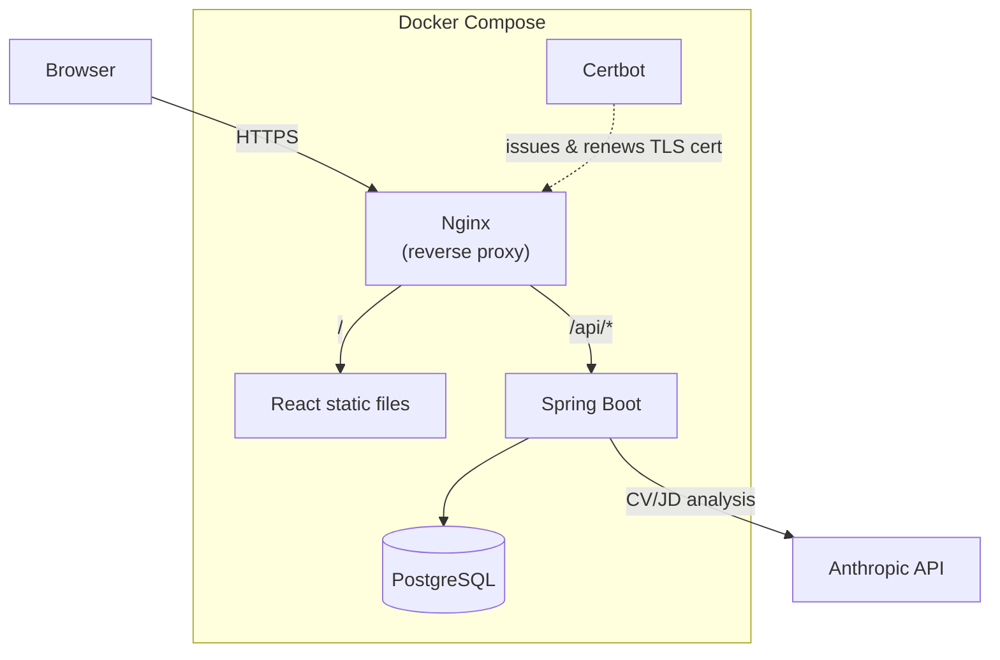

# Job Comparer

AI-powered CV-to-job matching - analyze how well a CV fits a job description in 
seconds.

**Live demo: https://jobs.yuejiang.net**

## Overview

Job Comparer is a full-stack web application that uses an LLM to compare a 
candidate's CV against a job description and return a structured match analysis: a
match score, matched skills, missing skills, and actionable feedback. Users can 
manage their CVs and jobs, run analyses, and review their analysis history.

The project is built with Spring Boot and React, fully containerized with Docker, 
and deployed on AWS EC2 behind Nginx with HTTPS.

## Features

- **Authentication** - registration and login with JWT (Spring Security 6)
- **CV & Job management** - full CRUD with soft delete
- **AI analysis** - compares a CV against a job and returns a structured result 
(match score, matched/missing skills, feedback)
- **Analysis history** - review and delete past analyses
- **Public landing page** - a live example analysis visible without signing up
- **Rate limiting** - per-user and global daily limits to control AI cost

## Tech Stack

**Backend**
- Java 17, Spring Boot 3
- Spring Security 6 + JWT (jjwt)
- Spring Data JPA / Hibernate
- PostgreSQL
- Flyway (database migrations)
- Spring AI (Anthropic Claude)

**Frontend**
- React 19, Vite
- React Router
- Tailwind CSS
- Context API (auth state)

**Infrastructure**
- Docker & Docker Compose
- Nginx (reverse proxy + static file serving)
- AWS EC2
- Let's Encrypt (HTTPS, auto-renewal)

## Architecture

The application runs as four Docker containers orchestrated by Docker compose:

Because Nginx serves the frontend and proxies the API from the same origin, no CORS
configuration is needed. The backend and database are not exposed publicly - only 
Nginx is reachable from the internet.

## Key Engineering Decisions

### Snapshot vs. reference for analysis history
An analysis references a CV and a Job by id, but both are mutable and can be 
soft-deleted. Joining the *current* CV/Job to display history would show data that
may no longer match what was actually analyzed. To keep each history record faithful
to the moment it was created, the CV name, job title, and company are snapshotted 
onto the analysis row at creation time. The result fields (score, skills, feedback)
were already point-in-time data, so the record stays self-contained even if the 
original CV or Job is later edited or deleted.

### Rate limiting to control AI cost
Each analysis calls a paid LLM API, so the endpoint enforces per-user and global 
daily limits, checked *before* the API call so rejected requests cost nothing. The 
count is date-based (resets daily without a scheduler) and includes soft-deleted 
analyses - deleting a history entry shouldn't refund a request the user already paid
for, since the cost was incurred at creation.

### Externalized configuration and containerization
Secrets (DB credentials, JWT secret, API key) are injected via environment 
variables with no defaults, so a missing value fails fast at startup instead of 
falling back to something insecure. This makes the same build environment-agnostic,
which is the prerequisite for containerization. The backend uses a multi-stage 
Docker build: a Maven stage compiles the jar, and a slim JRE stage runs it - the 
final image contains no build tools or source.

### HTTPS and same-origin via Nginx
Nginx serves the React static files and reverse-proxies `/api` to the backend, so
the frontend and API share one origin and no CORS configuration is needed. Only 
Nginx is exposed publicly; the backend and database stay on the internal Docker 
network. TLS certificates are issued and auto-renewed by a Certbot container that 
shares volumes with Nginx.

## Running Locally

The deployed configuration uses HTTPS with Let's Encrypt, which requires a domain 
and certificates. To try the app, the easiest way is the 
**[live demo](https://jobs.yuejiang.net)**.

To run locally, you would need Docker, an Anthropic API key, and to adapt the Nginx
config for local (non-HTTPS) use. The stack starts with 
`docker compose up --build` once a `.env` file (DB password, JWT secret, Anthropic
API key) is provided.

## Repository Structure

This is the backend repository, which also contains the Docker Compose setup for 
the full stack.

- **Backend** (this repo): https://github.com/jiangyue95/job-comparer
- **Frontend**: https://github.com/jiangyue95/job-comparer-frontend