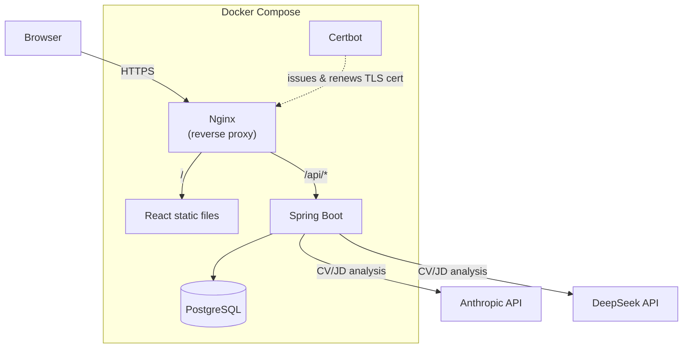

# Job Comparer

AI-powered CV-to-job matching - submit a CV and a job description, and get back a
structured match analysis.

**Live demo: https://jobs.yuejiang.net**

## Overview

Job Comparer is a full-stack web application that uses an LLM to compare a
candidate's CV against a job description and return a structured match analysis: a
match score, matched skills, missing skills, and actionable feedback. Users can
manage their CVs and jobs, run analyses, and review their analysis history.

The project is built with Spring Boot and React, fully containerized with Docker,
and deployed on AWS EC2 behind Nginx with HTTPS.

## Features

- **Authentication** - registration and login with JWT (Spring Security 6)
- **CV & Job management** - full CRUD with soft delete
- **AI analysis** - compares a CV against a job and returns a structured result (match score, matched/missing skills,
  feedback)
- **Analysis history** - review and delete past analyses
- **Public landing page** - a live example analysis visible without signing up
- **Per-plan quotas** - `FREE` and `PREMIUM` tiers with per-user limits on CVs,
  jobs, and daily analyses, plus a global daily cap on AI spend
- **Asynchronous analysis** - submissions return immediately and are processed on
  a bounded worker pool; the client polls for the result
- **Unread tracking** - finished analyses are marked unread until opened, surfaced
  as a badge in the navigation

## Tech Stack

**Backend**

- Java 17, Spring Boot 3
- Spring Security 6 + JWT (jjwt)
- Spring Data JPA / Hibernate
- PostgreSQL
- Flyway (database migrations)
- Spring AI (Anthropic Claude, DeepSeek)

**Frontend**

- React 19, Vite
- React Router
- Tailwind CSS
- Context API (auth state)

**Infrastructure**

- Docker & Docker Compose
- Nginx (reverse proxy + static file serving)
- AWS EC2
- Let's Encrypt (HTTPS, auto-renewal)

## Architecture

The application runs as five Docker containers orchestrated by Docker Compose:

```mermaid
graph TD
    Browser["Browser"] -->|HTTPS| Nginx["Nginx<br/>(reverse proxy)"]
    Nginx -->|" / "| React["React static files"]
    Nginx -->|" /api/* "| Backend["Spring Boot"]
    Backend --> DB[("PostgreSQL")]
    Backend -->|CV/JD analysis| AI["Anthropic API"]
    Backend -->|CV/JD analysis| DS["DeepSeek API"]
    Certbot["Certbot"] -.->|issues & renews TLS cert| Nginx

    subgraph docker["Docker Compose"]
        Nginx
        React
        Backend
        DB
        Certbot
    end
```

Because Nginx serves the frontend and proxies the API from the same origin, no CORS
configuration is needed. The backend and database are not exposed publicly - only
Nginx is reachable from the internet.

## Key Engineering Decisions

### Snapshot vs. reference for analysis history

An analysis references a CV and a Job by id, but both are mutable and can be
soft-deleted. Joining the *current* CV/Job to display history would show data that
may no longer match what was actually analyzed. To keep each history record faithful
to the moment it was created, the CV name, job title, and company are snapshotted
onto the analysis row at creation time. The result fields (score, skills, feedback)
were already point-in-time data, so the record stays self-contained even if the
original CV or Job is later edited or deleted.

### Per-plan quotas and the global cost cap

Each analysis calls a paid LLM API, so quotas are enforced *before* the call and a
rejected request costs nothing. Users are capped on CVs, jobs, and analyses per day,
and each user carries a plan (`FREE` or `PREMIUM`) that determines those allowances -
kept as a field of its own rather than folded into the role, since a role says what a
user may do and a plan says how much they may consume.

The two daily limits are deliberately not the same kind of rule. The per-user limit is
about fairness between accounts, so a paid tier can be exempted from it. The global
limit protects the service's own spend: a breaker with an exception path is not a
breaker, so no tier bypasses it.

The numbers themselves live in configuration rather than in code, and are checked at
startup against the `Plan` enum, so a missing or misspelled tier fails the boot rather
than the first request that needs it. Counting is date-based, which resets daily
without a scheduler, and includes soft-deleted analyses - deleting a history entry
shouldn't refund a request the user already paid for, since the cost was incurred at
creation.

### Asynchronous analysis and the transaction boundary

An LLM call takes seconds, and holding an HTTP request open for that long ties up
a Tomcat thread for the entire duration. Submitting an analysis now writes a
`PENDING` row, returns `202 Accepted` immediately, and hands the work to a bounded
thread pool; the client polls the analysis by id until it reaches a terminal state.

The dispatch happens in a `@TransactionalEventListener(AFTER_COMMIT)` rather than
at the end of the service method. A background thread runs in its own transaction
and cannot see rows the submitting transaction has not committed yet, so
dispatching before the commit is a race that passes locally and fails
intermittently under load. The event itself carries only the analysis id and user
id - passing the entity would hand a detached object to another thread, and the
`SecurityContext` does not cross thread boundaries either, so the worker
re-establishes what it needs from the ids.

The worker deliberately has no `@Transactional` annotation. Wrapping it would hold
a pooled database connection open across a multi-second call to a third party, and
a handful of concurrent analyses would exhaust the connection pool and stall every
other request in the application. Instead it opens three short transactions -
marking the row `PROCESSING`, then writing either the result or the failure - with
the network call sitting between them, outside any transaction.

Rejection is handled rather than hidden. The task is submitted through an explicit
`executor.execute()` rather than `@Async`, because `@Async` throws
`RejectedExecutionException` from the proxy, where the method body never runs and
nothing can catch it - the row would sit at `PENDING` forever. Submitting manually
makes the rejection catchable, so a full queue produces a `FAILED` row with a
reason instead of a silent stall. The pool's rejection policy is `AbortPolicy` for
the same reason `CallerRunsPolicy` is wrong here: the calling thread at that point
is the HTTP worker that just committed the transaction, and running a multi-second
job on it would push the backpressure straight back into the web layer.

Failures are terminal and explicit. There is no automatic retry - a failed
analysis is retried by creating a new row, which matches the snapshot semantics
above and removes the concurrency questions a mutating retry would raise. A
restart marks any row left in a non-terminal state as `INTERRUPTED` on startup, so
no analysis is left claiming to be running when nothing is running it.

### Multiple AI providers behind one interface

Analysis can run against Anthropic or DeepSeek, selected per request with a
server-side fallback to the configured default. Each provider is an `AiClient`
implementation; an `AiClientResolver` builds a provider-to-client map once at
startup from the injected list, so an unregistered provider fails at resolution
with a clear message rather than a null client further down.

The provider is stored as a `VARCHAR` with `EnumType.STRING`, not as a PostgreSQL
native enum and not as an ordinal. A native enum would require an `ALTER TYPE` to
add a provider, turning a configuration change into a migration; an ordinal would
silently reinterpret every historical row the first time someone reorders the Java
enum. The migration that introduced the column backfilled existing rows with
`DEFAULT 'ANTHROPIC'` and then dropped the default, because that value is a
one-off historical fact about rows written before the column existed, not a
business rule - leaving the default in place would mask a service-layer bug that
failed to set the provider.

### Externalized configuration and containerization

Secrets (DB credentials, JWT secret, API key) are injected via environment
variables with no defaults, so a missing value fails fast at startup instead of
falling back to something insecure. This makes the same build environment-agnostic,
which is the prerequisite for containerization. The backend uses a multi-stage
Docker build: a Maven stage compiles the jar, and a slim JRE stage runs it - the
final image contains no build tools or source.

### HTTPS and same-origin via Nginx

Nginx serves the React static files and reverse-proxies `/api` to the backend, so
the frontend and API share one origin and no CORS configuration is needed. Only
Nginx is exposed publicly; the backend and database stay on the internal Docker
network. TLS certificates are issued and auto-renewed by a Certbot container that
shares volumes with Nginx.

## Running Locally

The deployed configuration uses HTTPS with Let's Encrypt, which requires a domain
and certificates. To try the app, the easiest way is the **[live demo](https://jobs.yuejiang.net)**.

To run locally, you would need Docker, an API key for at least one supported AI
provider, and to adapt the Nginx config for local (non-HTTPS) use. The stack starts
with `docker compose up --build` once a `.env` file (DB password, JWT secret,
provider API keys) is provided.

## Repository Structure

This is the backend repository, which also contains the Docker Compose setup for
the full stack.

- **Backend** (this repo): https://github.com/jiangyue95/job-comparer
- **Frontend**: https://github.com/jiangyue95/job-comparer-frontend
